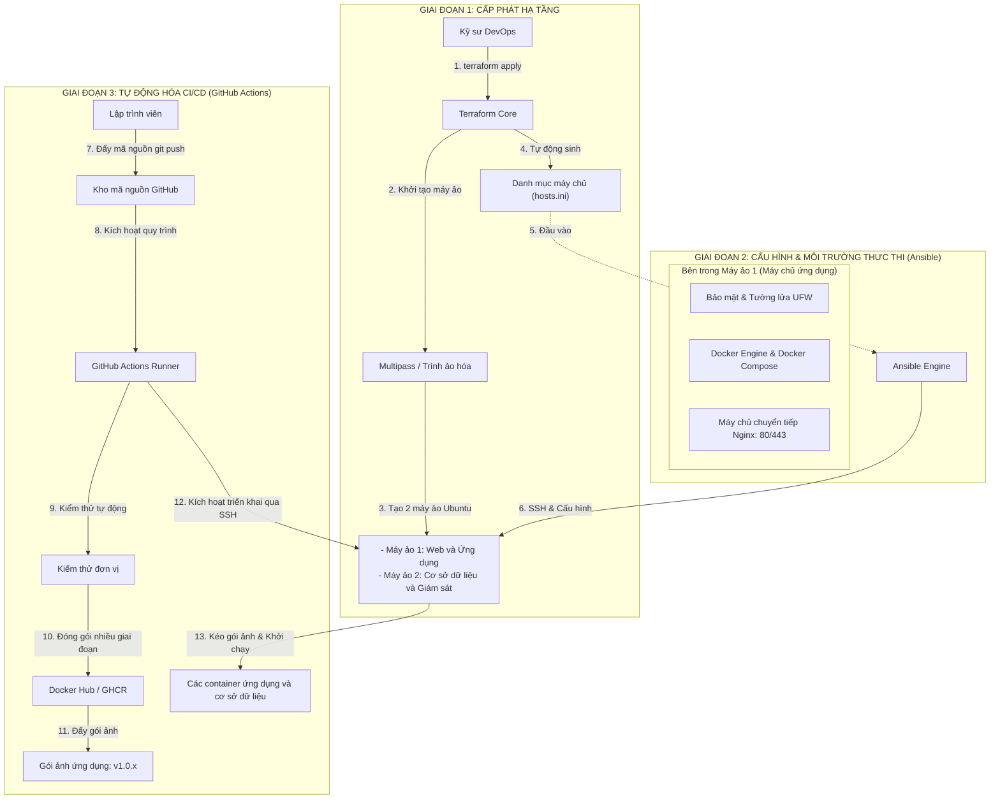
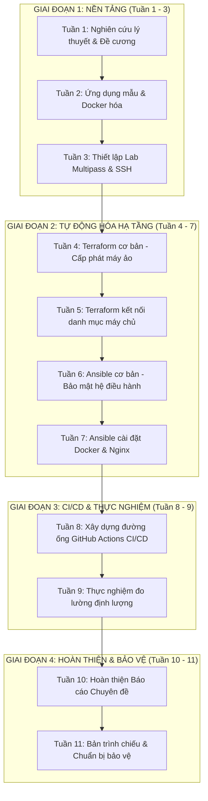

# CHUYÊN ĐỀ KỸ THUẬT PHẦN MỀM (CSE408)
## Đề tài: Tìm hiểu quy trình tự động hóa hạ tầng và CI/CD với Docker dựa trên Terraform và Ansible

[](https://github.com)
[](https://github.com)
[](https://github.com)
[](https://github.com)
[](https://multipass.run)

> **Sinh viên thực hiện:** Phùng Văn Duy – **MSSV:** 2352270589  
> **Giảng viên hướng dẫn:** Nguyễn Thọ Thông  
> **Học kỳ:** Học kỳ 7 – Năm học 2026-2027

---

## 📑 Mục Lục
1. [Tổng quan Đề tài & Tính cấp thiết](#1-tổng-quan-đề-tài--tính-cấp-thiết)
2. [Mục tiêu và Phạm vi Nghiên cứu](#2-mục-tiêu-và-phạm-vi-nghiên-cứu)
3. [Kiến trúc Kỹ thuật Tổng thể](#3-kiến-trúc-kỹ-thuật-tổng-thể)
4. [Đánh giá Tính khả thi & Phân tích Kỹ thuật](#4-đánh-giá-tính-khả-thi--phân-tích-kỹ-thuật)
5. [Lộ trình Triển khai Chi tiết 11 Tuần](#5-lộ-trình-triển-khai-chi-tiết-11-tuần)
6. [Kế hoạch Thực nghiệm & Đo lường](#6-kế-hoạch-thực-nghiệm--đo-lường)
7. [Cấu trúc Thư mục Dự án Đề xuất](#7-cấu-trúc-thư-mục-dự-án-đề-xuất)
8. [Cấu trúc Báo cáo Chuyên đề (5 Chương)](#8-cấu-trúc-báo-cáo-chuyên-đề-5-chương)

---

## 1. Tổng quan Đề tài & Tính cấp thiết

Trong quy trình phát triển và vận hành phần mềm hiện đại, việc cấu hình máy chủ thủ công bộc lộ nhiều hạn chế nghiêm trọng:
* **Trôi dạt cấu hình:** Môi trường phát triển, thử nghiệm và vận hành thực tế bị lệch nhau theo thời gian do các can thiệp thủ công, dẫn đến lỗi "chạy được ở máy cục bộ nhưng lỗi trên máy chủ".
* **Tốc độ triển khai chậm:** Mất hàng giờ hoặc hàng ngày để khởi tạo lại một máy chủ từ đầu khi gặp sự cố.
* **Thiếu khả năng truy vết:** Không có lịch sử thay đổi phiên bản cấu hình hạ tầng trên Git.

Đề tài **"Tìm hiểu quy trình tự động hóa hạ tầng và CI/CD với Docker dựa trên Terraform và Ansible"** giải quyết triệt để bài toán này bằng cách kết hợp sức mạnh của 4 trụ cột công nghệ:
1. **Terraform:** Tự động hóa khởi tạo và cấp phát tài nguyên phần cứng theo mô hình hạ tầng dưới dạng mã nguồn.
2. **Ansible:** Tự động hóa cài đặt hệ điều hành, cấu hình bảo mật, môi trường thực thi và máy chủ chuyển tiếp Nginx theo mô hình quản lý cấu hình.
3. **Docker và Docker Compose:** Đóng gói ứng dụng cô lập, tối ưu hóa kích thước và đảm bảo ứng dụng chạy đồng nhất trên mọi môi trường.
4. **GitHub Actions:** Tự động hóa kiểm thử, đóng gói và kích hoạt triển khai liên tục lên máy chủ.

---

## 2. Mục tiêu và Phạm vi Nghiên cứu

### 2.1. Mục tiêu
* **Lý thuyết:** Làm rõ sự khác biệt bản chất giữa khởi tạo hạ tầng (Terraform) và quản lý cấu hình (Ansible); nắm vững nguyên lý tính nhất quán và hạ tầng bất biến.
* **Thực hành:** Xây dựng thành công chuỗi tự động hóa khép kín: Khởi tạo máy ảo $\rightarrow$ Cấu hình máy chủ $\rightarrow$ Triển khai ứng dụng được đóng gói qua đường ống CI/CD chỉ với **1 dòng lệnh** hoặc **1 thao tác đẩy mã nguồn lên Git (`git push`)**.
* **Đánh giá thực nghiệm:** Thu thập số liệu đo lường định lượng (thời gian, độ tin cậy, khả năng phục hồi sau sự cố) để chứng minh tính ưu việt của giải pháp tự động so với phương pháp thủ công truyền thống.

### 2.2. Phạm vi nghiên cứu
* **Môi trường hạ tầng:** Sử dụng cụm máy ảo Ubuntu được quản lý bởi **Canonical Multipass** trên máy cục bộ (tiết kiệm 100% chi phí Cloud nhưng mô phỏng chính xác cấu trúc mạng của VPS thực tế).
* **Ứng dụng mẫu:** Ứng dụng Backend RESTful API (Node.js/Express hoặc Go) kết nối cơ sở dữ liệu (PostgreSQL/MongoDB).
* **Công cụ cốt lõi:** Terraform, Ansible, Docker, Docker Compose, Nginx, GitHub Actions, Multipass.

---

## 3. Kiến trúc Kỹ thuật Tổng thể

### 3.1. Sơ đồ Luồng Tích hợp Toàn diện



### 3.2. Phân công Trách nhiệm Công nghệ

| Công cụ | Phân tầng | Trách nhiệm chính | Đặc điểm then chốt |
| :--- | :--- | :--- | :--- |
| **Multipass** | Ảo hóa hạ tầng | Ảo hóa máy ảo Ubuntu trên môi trường thực hành | Gọn nhẹ, chuẩn bị sẵn tài nguyên, chi phí 0đ |
| **Terraform** | Khởi tạo hạ tầng | Khởi tạo máy ảo, cấp phát CPU/RAM/ổ cứng, xuất địa chỉ IP | Mô hình khai báo, quản lý tệp trạng thái (`.tfstate`) |
| **Ansible** | Quản lý cấu hình | Cài đặt gói phần mềm, bảo mật hệ điều hành, cài Docker, cấu hình Nginx | Không cần cài đặt phần mềm đại lý, đảm bảo tính nhất quán |
| **Docker** | Đóng gói container | Đóng gói ứng dụng kèm môi trường thực thi | Kỹ thuật nhiều giai đoạn, gói ảnh nền nhẹ (Alpine) |
| **GitHub Actions** | Tích hợp và triển khai liên tục | Chạy kiểm thử đơn vị, đóng gói ứng dụng, kích hoạt triển khai | Tự động hóa hoàn toàn từ mã nguồn đến máy chủ |

---

## 4. Đánh giá Tính khả thi & Phân tích Kỹ thuật

### 4.1. Đánh giá Tính khả thi Tổng thể: **RẤT KHẢ THI (9.5/10)**
* **Mức độ phù hợp học phần:** Hoàn toàn đáp ứng và bám sát các tiêu chuẩn khắt khe của môn **Chuyên đề Kỹ thuật Phần mềm (CSE408)**. Đề tài không dừng lại ở mức làm theo hướng dẫn cơ bản mà có kiến trúc phân lớp chuẩn công nghiệp và có phần **đo lường định lượng** khoa học.
* **Khối lượng công việc:** Phân chia 11 tuần vừa vặn, trung bình mỗi tuần tập trung giải quyết 1 module công nghệ cốt lõi và có sản phẩm bàn giao rõ ràng.

### 4.2. Các Rủi ro Kỹ thuật Tiềm ẩn & Giải pháp Khắc phục

> [!IMPORTANT]
> **Rủi ro 1: Kiến trúc vi xử lý Apple Silicon (ARM64 vs AMD64)**
> * *Vấn đề:* Máy chủ CI/CD của GitHub chạy `x86_64` (amd64), trong khi máy ảo Multipass chạy trên macOS Apple Silicon là `aarch64` (arm64). Nếu GitHub build image `amd64`, máy ảo arm64 sẽ phải chạy qua giả lập chậm hoặc lỗi.
> * *Giải pháp:* Sử dụng `docker/setup-buildx-action` trong GitHub Actions để build đa kiến trúc: `--platform linux/amd64,linux/arm64`.

> [!WARNING]
> **Rủi ro 2: Mạng nội bộ Multipass và GitHub Actions (Tuần 8)**
> * *Vấn đề:* GitHub Actions Runner chạy trên Cloud không thể SSH trực tiếp vào IP riêng của máy ảo Multipass (ví dụ `192.168.64.x`) trên máy tính cá nhân.
> * *Giải pháp:*
>   1. **Giải pháp 1 (Tối ưu nhất):** Cài đặt **GitHub Actions Self-Hosted Runner** trực tiếp bên trong máy ảo Multipass. Runner kết nối ra GitHub qua HTTPS outbound, không cần mở port mạng hay cấu hình router.
>   2. **Giải pháp 2:** Dùng mạng ảo **Tailscale** hoặc **Cloudflare Tunnel** để tạo đường hầm an toàn kết nối GitHub Runner với máy ảo.
>   3. **Giải pháp 3:** Sử dụng 1 Cloud VPS miễn phí (AWS Free Tier / Oracle Cloud Free Tier) cho tuần 8-9 nếu muốn demo IP Public thật.

> [!TIP]
> **Rủi ro 3: Tích hợp giữa Terraform và Ansible (Tuần 5)**
> * *Vấn đề:* Truyền địa chỉ IP từ Terraform sang Ansible Inventory một cách tự động.
> * *Giải pháp:* Sử dụng resource `local_file` kết hợp hàm `templatefile()` trong Terraform để tự động sinh file `ansible/inventory/hosts.ini` ngay sau khi `terraform apply` hoàn tất.

---

## 5. Lộ trình Triển khai Chi tiết 11 Tuần



### Bảng Tóm tắt Tiến độ Triển khai 11 Tuần

| Tuần | Giai đoạn | Trọng tâm công việc | Sản phẩm bàn giao chính |
| :---: | :--- | :--- | :--- |
| **01** | **Nền tảng** | Nghiên cứu lý thuyết DevOps, IaC, CI/CD | Đề cương chi tiết & Bản nháp Chương 1 |
| **02** | **Nền tảng** | Viết ứng dụng mẫu REST API và cơ sở dữ liệu, đóng gói Docker nhiều giai đoạn | Dockerfile tối ưu kích thước, `docker-compose.yml` |
| **03** | **Nền tảng** | Dựng cụm 2 máy ảo Ubuntu bằng Multipass, cấu hình SSH | 2 máy ảo hoạt động ổn định, SSH không cần mật khẩu |
| **04** | **Tự động hóa** | Viết Terraform khởi tạo máy ảo, quản lý trạng thái | `terraform apply` sinh cụm máy ảo từ con số 0 |
| **05** | **Tự động hóa** | Tự động xuất danh mục máy chủ từ Terraform cho Ansible | Tệp `hosts.ini` tự sinh, kiểm tra tính nhất quán |
| **06** | **Tự động hóa** | Viết kịch bản Ansible cấu hình hệ điều hành, UFW, người dùng không phải root | Máy chủ được cập nhật, bảo mật tự động |
| **07** | **Tự động hóa** | Cài Docker Engine & Nginx qua Ansible | Ứng dụng hoạt động qua Nginx chỉ sau 1 lệnh Ansible |
| **08** | **CI/CD** | Xây dựng đường ống GitHub Actions đa nền tảng | Tự động hóa hoàn toàn từ `git push` đến triển khai trên máy ảo |
| **09** | **Thực nghiệm** | Đo lường 3 kịch bản (Thời gian tạo, Triển khai, Khôi phục) | Bảng số liệu & biểu đồ so sánh cho Chương 4 |
| **10** | **Hoàn thiện** | Hoàn thiện 5 Chương báo cáo, căn chỉnh định dạng chuẩn | Bản thảo toàn văn Báo cáo Chuyên đề (.pdf/.docx) |
| **11** | **Bảo vệ** | Thiết kế bản trình chiếu, chuẩn bị kịch bản biểu diễn trực tiếp | Trang trình chiếu 15-18 trang, kịch bản thuyết minh trơn tru |


---

### Tuần 1: Nghiên cứu tổng quan lý thuyết & Chuẩn bị đề cương
* **Mục tiêu:** Nắm vững các khái niệm cốt lõi của DevOps, hạ tầng dưới dạng mã nguồn và xác lập phạm vi chuyên đề.
* **Nội dung công việc:**
  - [ ] Tìm hiểu các khái niệm: Hạ tầng dưới dạng mã nguồn, Quản lý cấu hình, Tích hợp và Triển khai liên tục (CI/CD).
  - [ ] Phân tích so sánh chuyên sâu: Khởi tạo hạ tầng (Terraform) và Quản lý cấu hình (Ansible).
  - [ ] Khảo sát các nguyên lý hạ tầng hiện đại: Tính nhất quán, Hạ tầng bất biến, Kiểm thử sớm.
  - [ ] Viết nháp **Chương 1: Mở đầu** (Tính cấp thiết, mục tiêu nghiên cứu, đối tượng và phạm vi đề tài).
* **Kết quả đầu ra:**
  * Bản thảo đề cương chi tiết gửi giảng viên hướng dẫn duyệt.
  * Hoàn thiện bản nháp văn bản Chương 1 (`docs/report/Chapter1.md`).

---

### Tuần 2: Ứng dụng mẫu & Đóng gói Container với Docker
* **Mục tiêu:** Chuẩn bị ứng dụng backend mục tiêu và đóng gói chuẩn hóa.
* **Nội dung công việc:**
  - [ ] Xây dựng hoặc chọn 1 ứng dụng backend mẫu (Node.js/Express hoặc Go) có đầy đủ REST API và kết nối cơ sở dữ liệu (MongoDB hoặc PostgreSQL).
  - [ ] Thêm điểm kiểm tra `/healthz` và `/metrics` phục vụ kiểm tra trạng thái hoạt động của ứng dụng.
  - [ ] Viết `Dockerfile` áp dụng kỹ thuật đóng gói nhiều giai đoạn và chọn gói ảnh nền nhẹ (`alpine` hoặc `distroless`) nhằm tối ưu dung lượng và bảo mật.
  - [ ] Viết `docker-compose.yml` để chạy thử toàn bộ hệ thống (Ứng dụng + Cơ sở dữ liệu + Lưu trữ dữ liệu lâu dài) tại máy cục bộ.
* **Kết quả đầu ra:**
  * Mã nguồn ứng dụng tại thư mục `app/`.
  * Đo đạc kích thước gói ảnh Docker: So sánh dung lượng đóng gói thông thường và đóng gói nhiều giai đoạn.
  * Hệ thống chạy thông suốt cục bộ qua `docker compose up -d`.

---

### Tuần 3: Thiết lập môi trường lab với Multipass
* **Mục tiêu:** Dựng môi trường máy chủ ảo cục bộ để làm nơi triển khai không tốn chi phí máy chủ đám mây.
* **Nội dung công việc:**
  - [ ] Cài đặt Canonical Multipass trên máy tính macOS.
  - [ ] Nắm vững và thực hành các câu lệnh: `multipass launch`, `multipass exec`, `multipass info`, `multipass stop/purge`.
  - [ ] Tạo cặp khóa SSH (`ssh-keygen -t ed25519`) và cấu hình nạp sẵn khóa công khai vào máy ảo lúc khởi tạo.
  - [ ] Cấu hình khóa SSH để kết nối không cần mật khẩu từ máy chủ vật lý vào các máy ảo Multipass (`ssh ubuntu@<ip>`).
* **Kết quả đầu ra:**
  * Cụm 2 máy ảo Ubuntu 22.04 LTS (`app-server` và `db-monitor-server`) chạy ổn định.
  * Cấu hình mạng nội bộ thông suốt giữa máy chủ vật lý và các máy ảo (ping thông, SSH không cần mật khẩu).

---

### Tuần 4: Nghiên cứu & Thực hành Terraform cơ bản
* **Mục tiêu:** Hiểu cơ chế hoạt động của Terraform và viết mã nguồn khởi tạo tài nguyên.
* **Nội dung công việc:**
  - [ ] Tìm hiểu vòng đời lệnh của Terraform: `terraform init`, `plan`, `apply`, `destroy`.
  - [ ] Phân tích cơ chế quản lý trạng thái hạ tầng thông qua tệp `terraform.tfstate` và khóa trạng thái.
  - [ ] Viết mã nguồn Terraform tổ chức module chuẩn: `main.tf`, `variables.tf`, `outputs.tf`, `terraform.tfvars`.
  - [ ] Cấu hình Terraform kết nối để tự động tạo máy chủ ảo, cấp phát RAM, CPU, dung lượng đĩa và xuất ra địa chỉ IP.
* **Kết quả đầu ra:**
  * Chạy `terraform apply` tạo thành công cụm máy ảo từ con số 0.
  * Soạn thảo bản nháp nội dung lý thuyết cho **Chương 2: Cơ sở lý thuyết** (Kiến trúc Terraform, ngôn ngữ HCL, Quản lý trạng thái).

---

### Tuần 5: Hoàn thiện kịch bản Terraform & Danh mục máy chủ tự động
* **Mục tiêu:** Kết nối đầu ra của Terraform với đầu vào của Ansible một cách liền mạch.
* **Nội dung công việc:**
  - [ ] Cấu hình `outputs.tf` trong Terraform để xuất danh sách IP và thông tin máy chủ.
  - [ ] Sử dụng tài nguyên `local_file` kết hợp mẫu cấu hình để Terraform tự động tạo ra tệp `ansible/inventory/hosts.ini` sau mỗi lần áp dụng (`apply`).
  - [ ] Kiểm tra và chứng minh tính nhất quán (chạy lại nhiều lần không sinh lỗi, không tạo trùng tài nguyên) của mã nguồn Terraform.
  - [ ] Viết kịch bản kiểm thử hạ tầng tự động.
* **Kết quả đầu ra:**
  * Quy trình Terraform hoàn chỉnh: Chỉ cần 1 lệnh `terraform apply`, toàn bộ máy chủ được sinh ra và tệp danh mục máy chủ cho Ansible sẵn sàng mà không cần điền tay IP.

---

### Tuần 6: Nghiên cứu Ansible & Viết Playbook cấu hình cơ bản
* **Mục tiêu:** Làm chủ Ansible và tự động hóa các tác vụ thiết lập hệ điều hành.
* **Nội dung công việc:**
  - [ ] Tìm hiểu cơ chế hoạt động không cần phần mềm đại lý của Ansible (dựa trên SSH và Python).
  - [ ] Nắm vững cấu trúc thư mục của Ansible: `playbooks/`, `roles/`, `group_vars/`, `inventory/`.
  - [ ] Viết vai trò cấu hình hệ thống:
    - Cập nhật gói phần mềm hệ thống (`apt update && apt upgrade`).
    - Cấu hình múi giờ hệ thống (múi giờ `Asia/Ho_Chi_Minh`).
    - Thiết lập tường lửa UFW (chỉ mở cổng 22, 80, 443).
    - Tạo tài khoản người dùng không phải root có quyền quản trị và cấu hình SSH bảo mật (vô hiệu hóa mật khẩu, chỉ dùng khóa).
* **Kết quả đầu ra:**
  * Chạy `ansible-playbook -i inventory/hosts.ini playbooks/site.yml` thành công.
  * Máy ảo tự động được cập nhật, bảo mật và vượt qua bài kiểm tra quét cổng.

---

### Tuần 7: Tự động hóa cài đặt Docker & Môi trường thực thi bằng Ansible
* **Mục tiêu:** Dùng Ansible biến máy chủ Linux thô thành môi trường sẵn sàng chạy Container.
* **Nội dung công việc:**
  - [ ] Viết vai trò Ansible cài Docker: Tự động cài đặt Docker Engine, Docker Compose, thêm người dùng vào nhóm `docker`.
  - [ ] Viết vai trò Ansible cài Nginx: Cài đặt Nginx làm máy chủ chuyển tiếp, cấu hình chuyển tiếp lưu lượng cổng 80/443 vào container ứng dụng.
  - [ ] Viết vai trò Ansible triển khai ứng dụng: Tự động tải cấu hình, kéo gói ảnh Docker về và khởi chạy container.
* **Kết quả đầu ra:**
  * Máy ảo có đầy đủ môi trường thực thi Docker và máy chủ chuyển tiếp Nginx.
  * Ứng dụng hoạt động trực tiếp, truy cập thành công qua trình duyệt web chỉ sau 1 lệnh `ansible-playbook`.

---

### Tuần 8: Xây dựng đường ống CI/CD với GitHub Actions
* **Mục tiêu:** Tự động hóa khâu kiểm thử mã nguồn, đóng gói và triển khai liên tục.
* **Nội dung công việc:**
  - [ ] Thiết lập kho mã nguồn GitHub chứa toàn bộ mã nguồn ứng dụng và cấu hình hạ tầng.
  - [ ] Cấu hình biến bí mật trên GitHub (`DOCKER_USERNAME`, `DOCKER_PASSWORD`, `SSH_PRIVATE_KEY`, `SERVER_HOST`).
  - [ ] Viết tệp quy trình `.github/workflows/deploy.yml` gồm các giai đoạn:
    - **Giai đoạn 1 (Kiểm thử):** Chạy kiểm tra quy chuẩn và kiểm thử đơn vị đối với mã nguồn.
    - **Giai đoạn 2 (Đóng gói & Đẩy lên kho lưu trữ):** Sử dụng Docker Buildx đóng gói ứng dụng đa kiến trúc và đẩy lên Docker Hub.
    - **Giai đoạn 3 (Triển khai):** Kích hoạt triển khai tự động: Kéo gói ảnh mới về và cập nhật không gián đoạn dịch vụ (`docker compose up -d --no-deps --build app`).
* **Kết quả đầu ra:**
  * Đường ống CI/CD thực thi thành công hoàn toàn từ khi đẩy mã nguồn đến lúc ứng dụng tự động cập nhật trên máy chủ.

---

### Tuần 9: Thực nghiệm đo lường và thu thập số liệu
* **Mục tiêu:** Lấy số liệu thực tế để chứng minh tính hiệu quả của giải pháp cho báo cáo.
* **Nội dung công việc:**
  - [ ] **Kịch bản 1 (Thời gian thiết lập hạ tầng):** Đo thời gian cài đặt máy chủ, Docker và Nginx bằng tay (gõ lệnh SSH thủ công) so với tự động hóa qua Terraform và Ansible (chạy 5 lần lấy giá trị trung bình).
  - [ ] **Kịch bản 2 (Tốc độ phân phối phần mềm):** Đo thời gian từ khi lập trình viên đẩy mã nguồn thay đổi lên Git đến khi phiên bản mới hoạt động ổn định trên máy chủ.
  - [ ] **Kịch bản 3 (Khả năng phục hồi sau sự cố):** Giả lập sự cố xóa toàn bộ máy chủ (`multipass delete --purge`), bấm giờ khôi phục toàn diện hệ thống từ con số 0 bằng mã nguồn tự động hóa.
  - [ ] Đo đạc dung lượng gói ảnh Docker (trước và sau khi tối ưu đóng gói nhiều giai đoạn).
* **Kết quả đầu ra:**
  * Bảng số liệu thô và các biểu đồ so sánh trực quan cho **Chương 4: Thực nghiệm & Đánh giá kết quả**.

---

### Tuần 10: Hoàn thiện Báo cáo Chuyên đề
* **Mục tiêu:** Tổng hợp toàn bộ lý thuyết, thiết kế kiến trúc và số liệu thành văn bản báo cáo hoàn chỉnh.
* **Nội dung công việc:**
  - [ ] Hoàn thiện **Chương 3: Phân tích & Thiết kế hệ thống** (vẽ sơ đồ kiến trúc luồng Terraform $\rightarrow$ Ansible $\rightarrow$ GitHub Actions $\rightarrow$ Docker).
  - [ ] Hoàn thiện **Chương 4: Thực nghiệm & Đánh giá kết quả** (trình bày bảng số liệu, biểu đồ phân tích và bàn luận kết quả đo lường từ Tuần 9).
  - [ ] Hoàn thiện **Chương 5: Kết luận & Hướng phát triển** (tổng kết kết quả đạt được, hạn chế của đề tài, định hướng mở rộng hệ thống).
  - [ ] Chuẩn hóa định dạng văn bản theo đúng quy định của khoa và nhà trường (phông chữ, căn lề, số trang, mục lục, trích dẫn tài liệu tham khảo chuẩn IEEE).
* **Kết quả đầu ra:**
  * Bản thảo Báo cáo Chuyên đề hoàn chỉnh (tệp `.docx` / `.pdf`) nộp cho giảng viên hướng dẫn xin nhận xét.

---

### Tuần 11: Chỉnh sửa báo cáo, Hoàn thiện bản trình chiếu & Chuẩn bị bảo vệ
* **Mục tiêu:** Tự tin bảo vệ đề tài trước Hội đồng chấm chuyên đề.
* **Nội dung công việc:**
  - [ ] Tiếp thu và chỉnh sửa toàn bộ góp ý của giảng viên hướng dẫn vào bản báo cáo cuối cùng.
  - [ ] Thiết kế bản trình chiếu báo cáo chuyên nghiệp (15 - 18 trang):
    - Đặt vấn đề & Mục tiêu đề tài.
    - Kiến trúc giải pháp tổng thể.
    - Trình diễn các công nghệ: Terraform, Ansible, Docker, GitHub Actions.
    - Bảng biểu so sánh số liệu thực nghiệm.
    - Kết luận & Bài học kinh nghiệm.
  - [ ] Chuẩn bị kịch bản biểu diễn trực tiếp:
    - *Thực nghiệm 1:* Chạy 1 lệnh khởi tạo hạ tầng và cấu hình máy chủ tự động.
    - *Thực nghiệm 2:* Thay đổi phiên bản ứng dụng, đẩy mã nguồn lên Git để hội đồng quan sát GitHub Actions tự động đóng gói và máy chủ tự cập nhật sau khoảng 2 phút.
* **Kết quả đầu ra:**
  * Tệp bản trình chiếu báo cáo (PowerPoint / PDF).
  * Video ghi lại quá trình biểu diễn dự phòng sự cố mạng.
  * Sẵn sàng bảo vệ đạt kết quả cao nhất.

---

## 6. Kế hoạch Thực nghiệm & Đo lường

Để đề tài đạt điểm xuất sắc, bảng số liệu thực nghiệm tại **Tuần 9** được thiết kế so sánh định lượng rõ ràng:

### Bảng Chỉ số Đánh giá Hiệu năng

| Chỉ số đo lường | Phương pháp thủ công | Phương pháp tự động | Tỷ lệ cải thiện |
| :--- | :--- | :--- | :--- |
| **Thời gian cấp phát máy chủ và cấu hình hệ điều hành** | ~ 25 - 35 phút (gõ tay từng lệnh) | ~ 3 - 5 phút (tự động qua Terraform và Ansible) | Giảm **~ 85%** |
| **Tốc độ triển khai phiên bản mới** | ~ 10 - 15 phút (thao tác thủ công) | ~ 1.5 - 2.5 phút (tự động qua GitHub Actions) | Giảm **~ 80%** |
| **Thời gian khôi phục sự cố** | Mất hàng giờ (phụ thuộc trí nhớ con người) | ~ 5 phút (chạy lại kịch bản tự động) | Giảm **~ 95%** |
| **Tỷ lệ sai sót do con người** | Cao (gõ nhầm lệnh, thiếu biến môi trường) | Xấp xỉ **0%** (kịch bản tự động hóa đảm bảo tính nhất quán) | Tuyệt đối |
| **Dung lượng gói ảnh Docker** | ~ 850 MB - 1.2 GB (đóng gói thông thường) | ~ 50 MB - 120 MB (đóng gói nhiều giai đoạn trên Alpine) | Giảm **~ 85-90%** |

---

## 7. Cấu trúc Thư mục Dự án Đề xuất

```text
cse408-software-engineering-special-topic/
├── .github/
│   └── workflows/
│       ├── test.yml              # Quy trình kiểm thử tự động
│       └── deploy.yml            # Quy trình đóng gói và triển khai tự động
├── app/                          # Mã nguồn ứng dụng mẫu
│   ├── src/                      # Mã nguồn (Node.js/Express hoặc Go)
│   ├── tests/                    # Kiểm thử đơn vị và kiểm thử tích hợp
│   ├── Dockerfile                # Tệp đóng gói nhiều giai đoạn
│   ├── docker-compose.yml        # Chạy thử nghiệm cục bộ
│   └── package.json
├── terraform/                    # Mã nguồn khởi tạo hạ tầng
│   ├── main.tf                   # Định nghĩa máy ảo Multipass
│   ├── variables.tf              # Khai báo biến (RAM, CPU, gói ảnh)
│   ├── outputs.tf                # Xuất địa chỉ IP máy chủ
│   ├── templates/
│   │   └── inventory.tpl         # Mẫu sinh danh mục máy chủ cho Ansible
│   └── terraform.tfvars
├── ansible/                      # Quản lý cấu hình & Triển khai
│   ├── ansible.cfg               # Cấu hình kết nối SSH
│   ├── inventory/
│   │   └── hosts.ini             # Do Terraform tự động sinh ra
│   ├── playbooks/
│   │   ├── site.yml              # Kịch bản chính
│   │   ├── 01_system.yml         # Thiết lập hệ điều hành, tài khoản, UFW
│   │   ├── 02_docker.yml         # Cài đặt Docker và Compose
│   │   └── 03_deploy.yml         # Triển khai container và Nginx
│   └── roles/
│       ├── common/
│       ├── security/
│       ├── docker/
│       └── nginx/
├── docs/                         # Tài liệu chuyên đề & Báo cáo
│   ├── report/                   # 5 Chương báo cáo toàn văn
│   │   ├── Chapter1.md
│   │   ├── Chapter2.md
│   │   ├── Chapter3.md
│   │   ├── Chapter4.md
│   │   └── Chapter5.md
│   ├── week-report/              # Báo cáo tiến độ theo từng tuần
│   │   └── week-1.md
│   ├── presentation/             # Bản trình chiếu thuyết trình (.pptx / .pdf)
│   └── benchmarks/               # Dữ liệu đo lường, biểu đồ thực nghiệm
└── README.md                     # Tài liệu tổng quan đề tài
```

---

## 8. Cấu trúc Báo cáo Chuyên đề (5 Chương)

* **CHƯƠNG 1: MỞ ĐẦU**
  * 1.1. Bối cảnh và tính cấp thiết của đề tài.
  * 1.2. Mục tiêu nghiên cứu.
  * 1.3. Đối tượng và phạm vi nghiên cứu.
  * 1.4. Phương pháp nghiên cứu và bố cục báo cáo.
* **CHƯƠNG 2: CƠ SỞ LÝ THUYẾT & CÔNG NGHỆ LIÊN QUAN**
  * 2.1. Tổng quan văn hóa DevOps và nguyên lý CI/CD.
  * 2.2. Khái niệm Hạ tầng dưới dạng mã nguồn và Quản lý cấu hình.
  * 2.3. Nghiên cứu công nghệ: Terraform, Ansible, Docker, Nginx, GitHub Actions.
  * 2.4. So sánh các mô hình triển khai: Truyền thống và Tự động hóa.
* **CHƯƠNG 3: PHÂN TÍCH VÀ THIẾT KẾ HỆ THỐNG**
  * 3.1. Bài toán và yêu cầu hệ thống (Chức năng và phi chức năng).
  * 3.2. Thiết kế kiến trúc tổng thể.
  * 3.3. Thiết kế quy trình cấp phát hạ tầng với Terraform.
  * 3.4. Thiết kế quy trình cấu hình và quản trị với Ansible.
  * 3.5. Thiết kế đường ống CI/CD với GitHub Actions.
* **CHƯƠNG 4: THỰC NGHIỆM VÀ ĐÁNH GIÁ KẾT QUẢ**
  * 4.1. Môi trường cài đặt và kịch bản thực nghiệm.
  * 4.2. Kết quả triển khai thực tế.
  * 4.3. Đánh giá và đo lường hiệu năng qua 3 kịch bản thực nghiệm.
  * 4.4. Bàn luận kết quả và ưu nhược điểm của hệ thống.
* **CHƯƠNG 5: KẾT LUẬN VÀ HƯỚNG PHÁT TRIỂN**
  * 5.1. Các kết quả chính đã đạt được.
  * 5.2. Các mặt còn hạn chế.
  * 5.3. Hướng nghiên cứu và mở rộng tiếp theo (Kubernetes, GitOps, Giám sát hệ thống với Prometheus và Grafana).
* **TÀI LIỆU THAM KHẢO** (Chuẩn IEEE).
