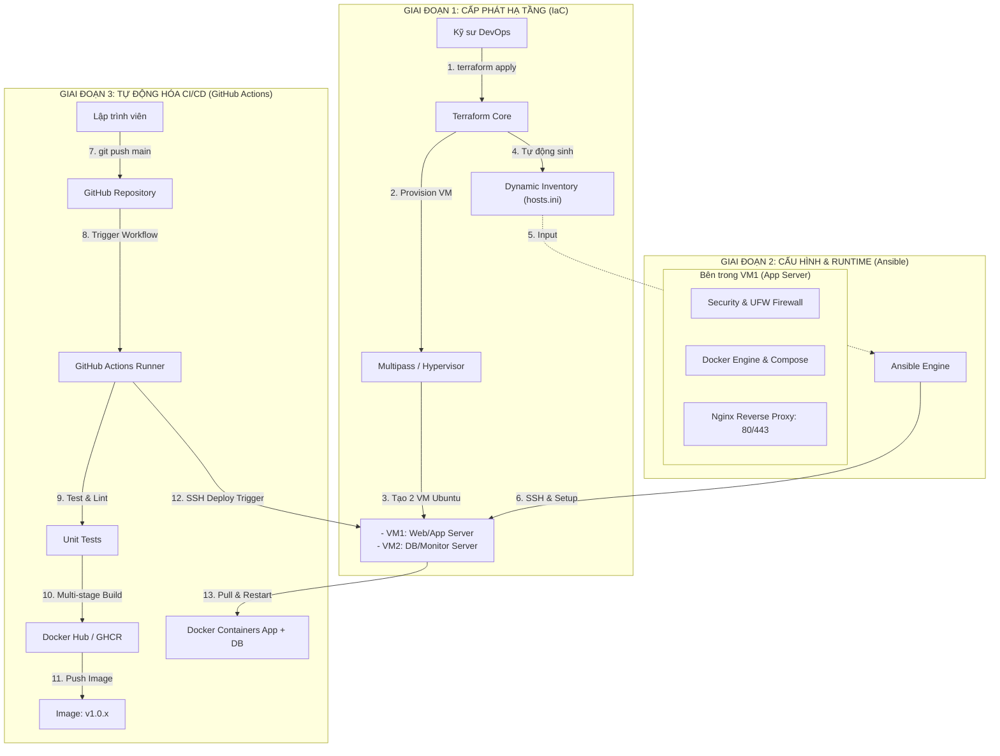
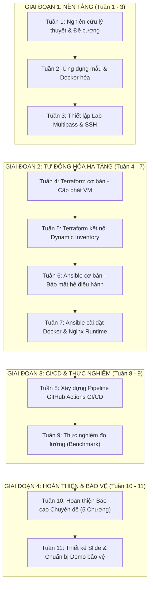

# CHUYÊN ĐỀ KỸ THUẬT PHẦN MỀM (CSE408)
## Đề tài: Tìm hiểu quy trình tự động hóa hạ tầng và CI/CD với Docker dựa trên Terraform và Ansible

[](https://github.com)
[](https://github.com)
[](https://github.com)
[](https://multipass.run)

---

## 📑 Mục Lục
1. [Tổng quan Đề tài & Tính cấp thiết](#1-tổng-quan-đề-tài--tính-cấp-thiết)
2. [Mục tiêu và Phạm vi Nghiên cứu](#2-mục-tiêu-và-phạm-vi-nghiên-cứu)
3. [Kiến trúc Kỹ thuật Tổng thể](#3-kiến-trúc-kỹ-thuật-tổng-thể)
4. [Đánh giá Tính khả thi & Phân tích Kỹ thuật](#4-đánh-giá-tính-khả-thi--phân-tích-kỹ-thuật)
5. [Lộ trình Triển khai Chi tiết 11 Tuần](#5-lộ-trình-triển-khai-chi-tiết-11-tuần)
6. [Kế hoạch Thực nghiệm & Đo lường (Benchmark)](#6-kế-hoạch-thực-nghiệm--đo-lường-benchmark)
7. [Cấu trúc Thư mục Dự án Đề xuất](#7-cấu-trúc-thư-mục-dự-án-đề-xuất)
8. [Cấu trúc Báo cáo Chuyên đề (5 Chương)](#8-cấu-trúc-báo-cáo-chuyên-đề-5-chương)

---

## 1. Tổng quan Đề tài & Tính cấp thiết

Trong quy trình phát triển và vận hành phần mềm hiện đại, việc cấu hình máy chủ thủ công (ClickOps / Manual SSH) bộc lộ nhiều hạn chế nghiêm trọng:
* **Lỗi cấu hình (Configuration Drift):** Khó đồng nhất giữa các môi trường Development, Staging và Production.
* **Tốc độ triển khai chậm:** Mất hàng giờ hoặc hàng ngày để khởi tạo lại một máy chủ từ đầu khi gặp sự cố.
* **Thiếu khả năng truy vết:** Không có lịch sử thay đổi phiên bản cấu hình hạ tầng trên Git.

Đề tài **"Tìm hiểu quy trình tự động hóa hạ tầng và CI/CD với Docker dựa trên Terraform và Ansible"** giải quyết triệt để bài toán này bằng cách kết hợp sức mạnh của 4 trụ cột công nghệ:
1. **Terraform (Infrastructure as Code - IaC):** Tự động hóa khâu khởi tạo và cấp phát tài nguyên phần cứng (Provisioning).
2. **Ansible (Configuration Management):** Tự động hóa cài đặt hệ điều hành, bảo mật (UFW, user), cài đặt runtime và reverse proxy.
3. **Docker & Docker Compose (Containerization):** Đóng gói ứng dụng cô lập, tối ưu hóa kích thước và đảm bảo ứng dụng chạy đồng nhất mọi nơi.
4. **GitHub Actions (CI/CD Pipeline):** Tự động hóa kiểm thử, đóng gói Docker image và kích hoạt triển khai liên tục lên máy chủ.

---

## 2. Mục tiêu và Phạm vi Nghiên cứu

### 2.1. Mục tiêu
* **Lý thuyết:** Làm rõ sự khác biệt bản chất giữa **Provisioning** (Terraform) và **Configuration Management** (Ansible); nắm vững nguyên lý **Idempotency** và **Immutable Infrastructure**.
* **Thực hành:** Xây dựng thành công chuỗi tự động hóa khép kín: Khởi tạo máy ảo $\rightarrow$ Cấu hình máy chủ $\rightarrow$ Triển khai ứng dụng containerized qua CI/CD với chỉ **1 dòng lệnh** hoặc **1 thao tác `git push`**.
* **Đánh giá thực nghiệm:** Thu thập số liệu đo lường định lượng (thời gian, độ tin cậy, khả năng phục hồi sau thảm họa) để chứng minh tính ưu việt của giải pháp tự động so với phương pháp thủ công truyền thống.

### 2.2. Phạm vi nghiên cứu
* **Môi trường hạ tầng:** Sử dụng cụm máy ảo Ubuntu được quản lý bởi **Canonical Multipass** trên máy cục bộ (tiết kiệm 100% chi phí Cloud nhưng mô phỏng chính xác cấu trúc mạng của VPS thực tế).
* **Ứng dụng mẫu:** Ứng dụng Backend RESTful API (Node.js/Express hoặc Go) kết nối cơ sở dữ liệu (PostgreSQL/MongoDB).
* **Công cụ cốt lõi:** Terraform, Ansible, Docker, Docker Compose, Nginx, GitHub Actions, Multipass.

---

## 3. Kiến trúc Kỹ thuật Tổng thể

### 3.1. Sơ đồ Luồng Tích hợp (End-to-End Workflow)



### 3.2. Phân công Trách nhiệm Công nghệ (Separation of Concerns)

| Công cụ | Phân tầng | Trách nhiệm chính | Đặc điểm then chốt |
| :--- | :--- | :--- | :--- |
| **Multipass** | Infrastructure | Ảo hóa máy ảo Ubuntu trên môi trường lab | Nhẹ, chuẩn Ubuntu Cloud-init, chi phí 0đ |
| **Terraform** | IaC (Provisioning) | Khởi tạo VM, cấp phát CPU/RAM/Disk, xuất IP | Khai báo (Declarative), Quản lý State (`.tfstate`) |
| **Ansible** | Config Management | Cài đặt package, bảo mật OS, cài Docker, cấu hình Nginx | Không cần Agent (Agentless), Idempotent |
| **Docker** | Containerization | Đóng gói ứng dụng kèm môi trường runtime | Multi-stage build, base image nhẹ (Alpine) |
| **GitHub Actions** | CI/CD | Chạy Unit Test, build Docker image, push registry, trigger deploy | Tự động hóa hoàn toàn từ mã nguồn đến triển khai |

---

## 4. Đánh giá Tính khả thi & Phân tích Kỹ thuật

### 4.1. Đánh giá Tính khả thi Tổng thể: **RẤT KHẢ THI (9.5/10)**
* **Mức độ phù hợp học phần:** Hoàn toàn đáp ứng và bám sát các tiêu chuẩn khắt khe của môn **Chuyên đề Kỹ thuật Phần mềm (CSE408)**. Đề tài không dừng lại ở mức "làm theo hướng dẫn" (tutorial) mà có kiến trúc phân lớp chuẩn công nghiệp và có phần **đo lường định lượng (Benchmark)** khoa học.
* **Khối lượng công việc:** Phân chia 11 tuần vừa vặn, trung bình mỗi tuần tập trung giải quyết 1 module công nghệ cốt lõi và có sản phẩm bàn giao (Deliverable) rõ ràng.

### 4.2. Các Rủi ro Kỹ thuật Tiềm ẩn & Giải pháp Khắc phục

> [!IMPORTANT]
> **Rủi ro 1: Kiến trúc vi xử lý Apple Silicon (ARM64 vs AMD64)**
> * *Vấn đề:* Máy chủ CI/CD của GitHub chạy `x86_64` (amd64), trong khi máy ảo Multipass chạy trên macOS Apple Silicon là `aarch64` (arm64). Nếu GitHub build image `amd64`, máy ảo arm64 sẽ phải chạy qua giả lập chậm hoặc lỗi.
> * *Giải pháp:* Sử dụng `docker/setup-buildx-action` trong GitHub Actions để build đa kiến trúc: `--platform linux/amd64,linux/arm64`.

> [!WARNING]
> **Rủi ro 2: Mạng nội bộ Multipass và GitHub Actions (Tuần 8)**
> * *Vấn đề:* GitHub Actions Runner chạy trên Cloud không thể SSH trực tiếp vào IP riêng của máy ảo Multipass (ví dụ `192.168.64.x`) trên máy tính cá nhân.
> * *Giải pháp:*
>   1. **Giải pháp 1 (Tối ưu nhất):** Cài đặt **GitHub Actions Self-Hosted Runner** trực tiếp bên trong máy ảo Multipass. Runner kết nối ra GitHub qua HTTPS outbound, không cần mở port mạng hay cấu hình router.
>   2. **Giải pháp 2:** Dùng mạng ảo **Tailscale** hoặc **Cloudflare Tunnel** để tạo đường hầm an toàn kết nối GitHub Runner với máy ảo.
>   3. **Giải pháp 3:** Sử dụng 1 Cloud VPS miễn phí (AWS Free Tier / Oracle Cloud Free Tier) cho tuần 8-9 nếu muốn demo IP Public thật.

> [!TIP]
> **Rủi ro 3: Tích hợp giữa Terraform và Ansible (Tuần 5)**
> * *Vấn đề:* Truyền địa chỉ IP từ Terraform sang Ansible Inventory một cách tự động.
> * *Giải pháp:* Sử dụng resource `local_file` kết hợp hàm `templatefile()` trong Terraform để tự động sinh file `ansible/inventory/hosts.ini` ngay sau khi `terraform apply` hoàn tất.

---

## 5. Lộ trình Triển khai Chi tiết 11 Tuần



### Bảng Tóm tắt Tiến độ Triển khai 11 Tuần

| Tuần | Giai đoạn | Trọng tâm công việc | Sản phẩm bàn giao chính (Deliverable) |
| :---: | :--- | :--- | :--- |
| **01** | **Nền tảng** | Nghiên cứu lý thuyết DevOps, IaC, CI/CD | Đề cương chi tiết & Bản nháp Chương 1 |
| **02** | **Nền tảng** | Viết App mẫu REST API + DB, Docker Multi-stage | Dockerfile tối ưu kích thước, `docker-compose.yml` |
| **03** | **Nền tảng** | Dựng cụm 2 VM Ubuntu bằng Multipass, cấu hình SSH | 2 VM hoạt động ổn định, SSH không mật khẩu |
| **04** | **Tự động hóa** | Viết Terraform khởi tạo máy ảo, quản lý state | `terraform apply` sinh cụm máy ảo từ con số 0 |
| **05** | **Tự động hóa** | Tự động xuất Dynamic Inventory từ Terraform cho Ansible | File `hosts.ini` tự sinh, kiểm tra tính Idempotent |
| **06** | **Tự động hóa** | Viết Ansible Playbook cấu hình OS, UFW, non-root user | Máy chủ được cập nhật, bảo mật tự động |
| **07** | **Tự động hóa** | Cài Docker Engine & Nginx Reverse Proxy qua Ansible | Ứng dụng live qua Nginx chỉ sau 1 lệnh Ansible |
| **08** | **CI/CD** | Xây dựng Pipeline GitHub Actions đa nền tảng | Pipeline xanh từ `git push` đến tự deploy trên VM |
| **09** | **Thực nghiệm** | Benchmark 3 kịch bản (Thời gian tạo, Deploy, DR) | Bảng số liệu & biểu đồ so sánh cho Chương 4 |
| **10** | **Hoàn thiện** | Hoàn thiện 5 Chương báo cáo, căn chỉnh format chuẩn | Bản thảo toàn văn Báo cáo Chuyên đề (.pdf/.docx) |
| **11** | **Bảo vệ** | Thiết kế Slide thuyết trình, chuẩn bị kịch bản Live Demo | Slide 15-18 trang, kịch bản demo trơn tru |


---

### Tuần 1: Nghiên cứu tổng quan lý thuyết & Chuẩn bị đề cương
* **Mục tiêu:** Nắm vững các khái niệm cốt lõi của DevOps, IaC và xác lập phạm vi chuyên đề.
* **Nội dung công việc:**
  - [ ] Tìm hiểu các khái niệm: *Infrastructure as Code (IaC)*, *Configuration Management*, *Continuous Integration / Continuous Deployment (CI/CD)*.
  - [ ] Phân tích so sánh chuyên sâu: Provisioning (Terraform) vs Configuration (Ansible).
  - [ ] Khảo sát các nguyên lý hạ tầng hiện đại: *Idempotence*, *Immutable Infrastructure*, *Shift-Left Testing*.
  - [ ] Viết nháp **Chương 1: Mở đầu** (Tính cấp thiết, mục tiêu nghiên cứu, đối tượng & phạm vi đề tài).
* **Kết quả đầu ra (Deliverables):**
  * Bản thảo đề cương chi tiết gửi giảng viên hướng dẫn duyệt.
  * Hoàn thiện bản nháp văn bản Chương 1 (`docs/report/Chapter1.md`).

---

### Tuần 2: Ứng dụng mẫu & Đóng gói Container với Docker
* **Mục tiêu:** Chuẩn bị ứng dụng backend mục tiêu và đóng gói chuẩn production.
* **Nội dung công việc:**
  - [ ] Xây dựng hoặc chọn 1 ứng dụng backend mẫu (Node.js/Express hoặc Go) có đầy đủ REST API CRUD và kết nối Database (MongoDB hoặc PostgreSQL).
  - [ ] Thêm API endpoint `/healthz` và `/metrics` phục vụ kiểm tra trạng thái hoạt động của ứng dụng.
  - [ ] Viết `Dockerfile` áp dụng kỹ thuật **Multi-stage build** và chọn Base Image nhẹ (`alpine` hoặc `distroless`) nhằm tối ưu dung lượng và bảo mật.
  - [ ] Viết `docker-compose.yml` để chạy thử toàn bộ hệ thống (App + Database + Volume persistent) tại máy cục bộ.
* **Kết quả đầu ra (Deliverables):**
  * Mã nguồn ứng dụng tại thư mục `app/`.
  * Đo đạc kích thước Docker image: So sánh dung lượng Single-stage build vs Multi-stage build.
  * Hệ thống chạy thông suốt cục bộ qua `docker compose up -d`.

---

### Tuần 3: Thiết lập môi trường lab với Multipass
* **Mục tiêu:** Dựng môi trường máy chủ ảo cục bộ để làm nơi triển khai không tốn chi phí Cloud.
* **Nội dung công việc:**
  - [ ] Cài đặt Canonical Multipass trên máy tính macOS.
  - [ ] Nắm vững và thực hành các câu lệnh CLI: `multipass launch`, `multipass exec`, `multipass info`, `multipass stop/purge`.
  - [ ] Tạo cặp khóa SSH (`ssh-keygen -t ed25519`) và cấu hình Cloud-init để tự động nạp Public Key vào máy ảo lúc khởi tạo.
  - [ ] Cấu hình SSH Key để kết nối không cần mật khẩu từ máy host vào các máy ảo Multipass (`ssh ubuntu@<ip>`).
* **Kết quả đầu ra (Deliverables):**
  * Cụm 2 máy ảo Ubuntu 22.04 LTS (`app-server` và `db-monitor-server`) chạy ổn định.
  * Cấu hình mạng nội bộ thông suốt giữa host và các máy ảo (ping thông, SSH không cần mật khẩu).

---

### Tuần 4: Nghiên cứu & Thực hành Terraform cơ bản
* **Mục tiêu:** Hiểu cơ chế hoạt động của Terraform và viết mã nguồn khởi tạo tài nguyên.
* **Nội dung công việc:**
  - [ ] Tìm hiểu vòng đời lệnh của Terraform: `terraform init`, `plan`, `apply`, `destroy`.
  - [ ] Phân tích cơ chế quản lý trạng thái hạ tầng thông qua file `terraform.tfstate` và khóa trạng thái (State Locking).
  - [ ] Viết mã nguồn Terraform tổ chức module chuẩn: `main.tf`, `variables.tf`, `outputs.tf`, `terraform.tfvars`.
  - [ ] Cấu hình Terraform kết nối provider để tự động tạo máy chủ ảo, cấp phát RAM, vCPU, dung lượng đĩa và xuất ra địa chỉ IP.
* **Kết quả đầu ra (Deliverables):**
  * Chạy `terraform apply` tạo thành công cụm máy ảo từ con số 0.
  * Soạn thảo bản nháp nội dung lý thuyết cho **Chương 2: Cơ sở lý thuyết** (Kiến trúc Terraform, HCL, State Management).

---

### Tuần 5: Hoàn thiện kịch bản Terraform & Dynamic Inventory
* **Mục tiêu:** Kết nối đầu ra của Terraform với đầu vào của Ansible một cách liền mạch.
* **Nội dung công việc:**
  - [ ] Cấu hình `outputs.tf` trong Terraform để xuất danh sách IP và metadata của máy chủ.
  - [ ] Sử dụng resource `local_file` kết hợp template `inventory.tpl` để Terraform tự động tạo ra file `ansible/inventory/hosts.ini` sau mỗi lần `apply`.
  - [ ] Kiểm tra và chứng minh tính **Idempotent** (chạy lại nhiều lần không sinh lỗi, không tạo trùng tài nguyên) của mã nguồn Terraform.
  - [ ] Viết kịch bản kiểm thử hạ tầng bằng Bash script hoặc Terratest.
* **Kết quả đầu ra (Deliverables):**
  * Pipeline Terraform hoàn chỉnh: Chỉ cần 1 lệnh `terraform apply`, toàn bộ máy chủ được sinh ra và file inventory cho Ansible sẵn sàng mà không cần điền tay IP.

---

### Tuần 6: Nghiên cứu Ansible & Viết Playbook cấu hình cơ bản
* **Mục tiêu:** Làm chủ Ansible và tự động hóa các tác vụ thiết lập hệ điều hành.
* **Nội dung công việc:**
  - [ ] Tìm hiểu cơ chế hoạt động **Agentless** của Ansible (chỉ dựa trên SSH và Python).
  - [ ] Nắm vững cấu trúc Ansible Directory: `playbooks/`, `roles/`, `group_vars/`, `inventory/`.
  - [ ] Viết Ansible Role `system_init`:
    - Cập nhật package hệ thống (`apt update && apt upgrade`).
    - Cấu hình múi giờ hệ thống (Timezone `Asia/Ho_Chi_Minh`).
    - Thiết lập tường lửa UFW (chỉ mở cổng 22, 80, 443).
    - Tạo user non-root có quyền sudo và cấu hình SSH bảo mật (vô hiệu hóa mật khẩu, chỉ dùng key).
* **Kết quả đầu ra (Deliverables):**
  * Chạy `ansible-playbook -i inventory/hosts.ini playbooks/site.yml` thành công.
  * Máy ảo tự động được cập nhật, bảo mật và vượt qua bài kiểm tra quét cổng.

---

### Tuần 7: Tự động hóa cài đặt Docker & Môi trường Runtime bằng Ansible
* **Mục tiêu:** Dùng Ansible biến máy chủ Linux thô thành môi trường sẵn sàng chạy Container.
* **Nội dung công việc:**
  - [ ] Viết Ansible Role `docker`: Tự động cài đặt Docker Engine, Docker Compose plugin, thêm user hiện tại vào group `docker`, cấu hình Docker daemon.
  - [ ] Viết Ansible Role `nginx`: Cài đặt Nginx làm Reverse Proxy, cấu hình trỏ domain/host header đón traffic cổng 80/443 và proxy_pass vào container ứng dụng.
  - [ ] Viết Ansible Role `deploy_app`: Tự động clone/copy cấu hình, kéo (pull) Docker Image của ứng dụng về và khởi chạy container.
* **Kết quả đầu ra (Deliverables):**
  * Máy ảo có đầy đủ Docker runtime, Nginx reverse proxy.
  * Ứng dụng chạy live, truy cập thành công qua trình duyệt web chỉ sau 1 lệnh `ansible-playbook`.

---

### Tuần 8: Xây dựng Pipeline CI/CD với GitHub Actions
* **Mục tiêu:** Tự động hóa khâu kiểm thử mã nguồn và đóng gói deploy liên tục.
* **Nội dung công việc:**
  - [ ] Thiết lập repository GitHub chứa toàn bộ mã nguồn ứng dụng và cấu hình IaC.
  - [ ] Cấu hình GitHub Secrets (`DOCKER_USERNAME`, `DOCKER_PASSWORD`, `SSH_PRIVATE_KEY`, `SERVER_HOST`).
  - [ ] Viết file workflow `.github/workflows/deploy.yml` gồm các stage:
    - **Stage 1 (Lint & Test):** Chạy linter và Unit Test kiểm tra logic code.
    - **Stage 2 (Build & Push):** Sử dụng Docker Buildx build multi-platform image và đẩy lên Docker Hub / GitHub Container Registry (GHCR).
    - **Stage 3 (Deploy):** Kích hoạt deploy thông qua SSH / Self-hosted runner: Kéo image mới về và cập nhật không gián đoạn (`docker compose up -d --no-deps --build app`).
* **Kết quả đầu ra (Deliverables):**
  * Pipeline CI/CD chạy xanh (Pass) 100% từ commit code đến khi ứng dụng tự cập nhật trên máy chủ thực tế.

---

### Tuần 9: Thực nghiệm đo lường, Thu thập số liệu (Benchmark)
* **Mục tiêu:** Lấy số liệu thực tế để chứng minh tính hiệu quả của giải pháp cho báo cáo.
* **Nội dung công việc:**
  - [ ] **Kịch bản 1 (Thời gian thiết lập hạ tầng):** Đo thời gian cài đặt máy chủ + Docker + Nginx bằng tay (gõ lệnh SSH thủ công) so với tự động hóa qua Terraform + Ansible (chạy 5 lần lấy giá trị trung bình).
  - [ ] **Kịch bản 2 (Tốc độ phân phối phần mềm - Deployment Cycle Time):** Đo thời gian từ lúc lập trình viên `git push` sửa 1 dòng code đến khi bản mới live trên server.
  - [ ] **Kịch bản 3 (Khả năng phục hồi thảm họa - Disaster Recovery):** Giả lập sự cố xóa toàn bộ máy chủ (`multipass delete --purge`), bấm giờ khôi phục toàn diện hệ thống từ con số 0 bằng mã nguồn IaC.
  - [ ] Đo đạc dung lượng Docker Image (trước và sau khi tối ưu Multi-stage).
* **Kết quả đầu ra (Deliverables):**
  * Bảng số liệu thô và các biểu đồ so sánh trực quan cho **Chương 4: Thực nghiệm & Đánh giá kết quả**.

---

### Tuần 10: Hoàn thiện Báo cáo Chuyên đề (5 Chương)
* **Mục tiêu:** Tổng hợp toàn bộ lý thuyết, thiết kế kiến trúc và số liệu thành văn bản báo cáo hoàn chỉnh.
* **Nội dung công việc:**
  - [ ] Hoàn thiện **Chương 3: Phân tích & Thiết kế hệ thống** (vẽ sơ đồ kiến trúc luồng Terraform $\rightarrow$ Ansible $\rightarrow$ GitHub Actions $\rightarrow$ Docker).
  - [ ] Hoàn thiện **Chương 4: Thực nghiệm & Đánh giá kết quả** (trình bày bảng số liệu, biểu đồ phân tích và bàn luận kết quả benchmark từ Tuần 9).
  - [ ] Hoàn thiện **Chương 5: Kết luận & Hướng phát triển** (tổng kết kết quả đạt được, hạn chế của đề tài, định hướng mở rộng Kubernetes/Monitoring).
  - [ ] Chuẩn hóa format văn bản theo đúng quy định của khoa/trường (font chữ, lề, số trang, mục lục, trích dẫn tài liệu tham khảo chuẩn IEEE).
* **Kết quả đầu ra (Deliverables):**
  * Bản thảo Báo cáo Chuyên đề hoàn chỉnh (file `.docx` / `.pdf`) nộp cho giảng viên hướng dẫn xin nhận xét.

---

### Tuần 11: Chỉnh sửa báo cáo, Làm Slide & Chuẩn bị Demo bảo vệ
* **Mục tiêu:** Tự tin bảo vệ đề tài trước Hội đồng chấm chuyên đề.
* **Nội dung công việc:**
  - [ ] Tiếp thu và chỉnh sửa toàn bộ góp ý của giảng viên hướng dẫn vào bản báo cáo cuối cùng.
  - [ ] Thiết kế Slide thuyết trình chuyên nghiệp (15 - 18 slides):
    - Đặt vấn đề & Mục tiêu đề tài.
    - Kiến trúc giải pháp tổng thể.
    - Demo các công nghệ: Terraform, Ansible, Docker, GitHub Actions.
    - Bảng biểu so sánh số liệu thực nghiệm.
    - Kết luận & Bài học kinh nghiệm.
  - [ ] Chuẩn bị kịch bản Demo trực tiếp (Live Demo Script):
    - *Demo 1:* Chạy 1 lệnh khởi tạo hạ tầng và cấu hình máy chủ tự động.
    - *Demo 2:* Đổi phiên bản hiển thị trên giao diện/API (vd: v1.0.0 $\rightarrow$ v2.0.0), `git commit` & `push` để hội đồng thấy GitHub Actions tự động build và máy chủ tự cập nhật chỉ sau ~2 phút.
* **Kết quả đầu ra (Deliverables):**
  * File Slide báo cáo (PowerPoint / PDF).
  * Video quay dự phòng buổi demo (Backup Demo Video phòng sự cố mạng).
  * Sẵn sàng bảo vệ đạt kết quả cao nhất.

---

## 6. Kế hoạch Thực nghiệm & Đo lường (Benchmark)

Để đề tài đạt điểm xuất sắc, bảng số liệu thực nghiệm tại **Tuần 9** được thiết kế so sánh định lượng rõ ràng:

### Bảng Chỉ số Đánh giá Hiệu năng (Key Metrics)

| Chỉ số đo lường (Metric) | Phương pháp Thủ công (Manual) | Phương pháp Tự động (IaC + CI/CD) | Tỷ lệ Cải thiện |
| :--- | :--- | :--- | :--- |
| **Thời gian cấp phát máy chủ & cấu hình OS** | ~ 25 - 35 phút (gõ tay từng lệnh) | ~ 3 - 5 phút (`terraform apply` & `ansible`) | Giảm **~ 85%** |
| **Tốc độ Deploy phiên bản mới** | ~ 10 - 15 phút (SSH, git pull, build tay) | ~ 1.5 - 2.5 phút (GitHub Actions push) | Giảm **~ 80%** |
| **Thời gian Khôi phục sự cố (MTTR - DR)** | Mất hàng giờ (phụ thuộc trí nhớ người gõ) | ~ 5 phút (Chạy lại kịch bản tự động) | Giảm **~ 95%** |
| **Tỷ lệ sai sót do con người (Human Error)** | Cao (gõ nhầm lệnh, thiếu biến môi trường) | Xấp xỉ **0%** (Idempotent Playbooks) | Tuyệt đối |
| **Dung lượng Docker Image (Node.js/Go)** | ~ 850 MB - 1.2 GB (Single-stage/Default) | ~ 50 MB - 120 MB (Multi-stage Alpine) | Giảm **~ 85-90%** |

---

## 7. Cấu trúc Thư mục Dự án Đề xuất

```text
cse408-software-engineering-special-topic/
├── .github/
│   └── workflows/
│       ├── test.yml              # CI: Linter, Unit test
│       └── deploy.yml            # CD: Build, Push, Deploy
├── app/                          # Mã nguồn ứng dụng mẫu
│   ├── src/                      # Source code (Node.js/Express hoặc Go)
│   ├── tests/                    # Unit tests & Integration tests
│   ├── Dockerfile                # Multi-stage build Dockerfile
│   ├── docker-compose.yml        # Chạy thử nghiệm local
│   └── package.json
├── terraform/                    # Mã nguồn khởi tạo hạ tầng (IaC)
│   ├── main.tf                   # Định nghĩa VM Multipass / Provider
│   ├── variables.tf              # Biến số (RAM, CPU, image,...)
│   ├── outputs.tf                # Xuất IP máy chủ
│   ├── templates/
│   │   └── inventory.tpl         # Template sinh file inventory cho Ansible
│   └── terraform.tfvars
├── ansible/                      # Quản lý cấu hình & Triển khai
│   ├── ansible.cfg               # Cấu hình SSH connection, timeout
│   ├── inventory/
│   │   └── hosts.ini             # Do Terraform tự động sinh ra
│   ├── playbooks/
│   │   ├── site.yml              # Playbook tổng
│   │   ├── 01_system.yml         # Setup OS, user, UFW
│   │   ├── 02_docker.yml         # Install Docker & Compose
│   │   └── 03_deploy.yml         # Deploy container & Nginx
│   └── roles/
│       ├── common/
│       ├── security/
│       ├── docker/
│       └── nginx/
├── docs/                         # Tài liệu chuyên đề & Báo cáo
│   ├── report/                   # 5 Chương báo cáo
│   │   ├── Chapter1_Introduction.md
│   │   ├── Chapter2_Theoretical_Background.md
│   │   ├── Chapter3_System_Design.md
│   │   ├── Chapter4_Experiments_Evaluation.md
│   │   └── Chapter5_Conclusion.md
│   ├── presentation/             # Slide thuyết trình (.pptx / .pdf)
│   └── benchmarks/               # Dữ liệu đo lường, biểu đồ thực nghiệm
└── README.md                     # Tài liệu tổng quan đề tài
```

---

## 8. Cấu trúc Báo cáo Chuyên đề (5 Chương)

* **CHƯƠNG 1: MỞ ĐẦU**
  * 1.1. Bối cảnh và tính cấp thiết của đề tài.
  * 1.2. Mục tiêu nghiên cứu.
  * 1.3. Đối tượng và phạm vi nghiên cứu.
  * 1.4. Phương pháp nghiên cứu và bố cục báo cáo.
* **CHƯƠNG 2: CƠ SỞ LÝ THUYẾT & CÔNG NGHỆ LIÊN QUAN**
  * 2.1. Tổng quan văn hóa DevOps và nguyên lý CI/CD.
  * 2.2. Khái niệm Infrastructure as Code (IaC) và Configuration Management.
  * 2.3. Nghiên cứu công nghệ: Terraform, Ansible, Docker, Nginx, GitHub Actions.
  * 2.4. So sánh các mô hình triển khai: Truyền thống vs Tự động hóa.
* **CHƯƠNG 3: PHÂN TÍCH VÀ THIẾT KẾ HỆ THỐNG**
  * 3.1. Bài toán và yêu cầu hệ thống (Chức năng & Phi chức năng).
  * 3.2. Thiết kế kiến trúc tổng thể (Architecture Overview).
  * 3.3. Thiết kế quy trình cấp phát hạ tầng với Terraform.
  * 3.4. Thiết kế quy trình cấu hình và quản trị với Ansible.
  * 3.5. Thiết kế đường ống CI/CD với GitHub Actions.
* **CHƯƠNG 4: THỰC NGHIỆM VÀ ĐÁNH GIÁ KẾT QUẢ**
  * 4.1. Môi trường cài đặt và kịch bản thực nghiệm.
  * 4.2. Kết quả triển khai thực tế.
  * 4.3. Đánh giá và đo lường hiệu năng (Benchmark 3 kịch bản).
  * 4.4. Bàn luận kết quả và ưu nhược điểm của hệ thống.
* **CHƯƠNG 5: KẾT LUẬN VÀ HƯỚNG PHÁT TRIỂN**
  * 5.1. Các kết quả chính đã đạt được.
  * 5.2. Các mặt còn hạn chế.
  * 5.3. Hướng nghiên cứu và mở rộng tiếp theo (Kubernetes, GitOps, Monitoring với Prometheus/Grafana).
* **TÀI LIỆU THAM KHẢO** (Chuẩn IEEE).
