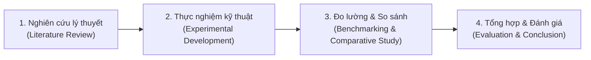

# CHƯƠNG 1: MỞ ĐẦU

## 1.1. Tính cấp thiết của đề tài

### 1.1.1. Bối cảnh thực tế và xu hướng phát triển phần mềm
Trong kỷ nguyên chuyển đổi số và phát triển phần mềm hiện đại, tốc độ đưa sản phẩm ra thị trường (*Time-to-Market*) và độ tin cậy của hệ thống (*System Reliability*) đã trở thành hai thước đo sống còn của mọi tổ chức công nghệ. Sự phổ biến của kiến trúc Microservices và điện toán đám mây (Cloud Computing) đã đẩy nhanh chu kỳ phát hành phần mềm từ hàng tháng xuống còn hàng ngày, thậm chí hàng giờ. 

Tuy nhiên, tốc độ phát triển mã nguồn nhanh chóng mặt này đang tạo ra một áp lực khổng lồ lên khâu vận hành hạ tầng (*Infrastructure Operations*). Nếu hạ tầng không thể được cấp phát, cấu hình và kiểm thử với tốc độ tương đương với tốc độ viết code của lập trình viên, nó sẽ trở thành "nút thắt cổ chai" (*bottleneck*) lớn nhất của toàn bộ quy trình phân phối giá trị.

### 1.1.2. Những hạn chế cố hữu của phương pháp quản lý hạ tầng truyền thống
Trước khi các khái niệm DevOps và Infrastructure as Code (IaC) ra đời, việc thiết lập và quản lý máy chủ phụ thuộc hoàn toàn vào các thao tác thủ công, thường được gọi là phương pháp tiếp cận **ClickOps** hoặc **Manual SSH Management**:
1. **Lỗi sai do con người (Human Error):** Khi một kỹ sư vận hành phải thực hiện hàng chục câu lệnh qua SSH để cài đặt hệ điều hành, phân quyền, cấu hình tường lửa, nguy cơ gõ nhầm lệnh hoặc bỏ sót các bước cấu hình bảo mật là điều không thể tránh khỏi.
2. **Hiện tượng trôi dạt cấu hình (Configuration Drift):** Đây là "cơn ác mộng" lớn nhất của các kỹ sư hệ thống. Sau một thời gian vận hành, môi trường Phát triển (Development), Thử nghiệm (Staging) và Vận hành chính thức (Production) dần bị lệch nhau do các chỉnh sửa "nóng" (hotfix) trực tiếp trên server mà không được ghi chép. Kết quả là câu nói kinh điển: *"Code chạy bình thường ở máy tôi nhưng lên server thì sập"* liên tục lặp lại.
3. **Tốc độ triển khai chậm và khả năng mở rộng kém:** Việc dựng một máy chủ mới mất từ vài giờ đến vài ngày. Khi lưu lượng người dùng tăng đột biến, hệ thống không thể tự động co giãn kịp thời.
4. **Khả năng phục hồi thảm họa (Disaster Recovery) cực kỳ thấp:** Khi xảy ra sự cố hỏng hóc phần cứng hoặc mất mát máy chủ, việc dựng lại toàn bộ môi trường phụ thuộc hoàn toàn vào trí nhớ của kỹ sư hoặc những tệp tài liệu hướng dẫn (Runbook) đã lỗi thời từ lâu.
5. **Thiếu khả năng kiểm soát phiên bản (No Versioning & Audit Trail):** Hạ tầng không có lịch sử thay đổi. Không ai biết ai đã thay đổi thông số gì trong file cấu hình, thay đổi khi nào và lý do tại sao.

### 1.1.3. Vai trò của DevOps, Infrastructure as Code (IaC) và CI/CD
Để giải quyết tận gốc các vấn đề trên, phong trào **DevOps** ra đời nhằm phá bỏ "bức tường ngăn cách" (Wall of Confusion) giữa đội ngũ Phát triển (Dev) và Vận hành (Ops). Trọng tâm của DevOps là văn hóa cộng tác và triết lý tự động hóa tối đa (*Automate Everything*).

Trong hệ sinh thái DevOps, **Infrastructure as Code (IaC)** là bước tiến mang tính cách mạng: biến toàn bộ cơ sở hạ tầng (máy ảo, mạng, ổ đĩa, tường lửa, dịch vụ) thành các tệp mã nguồn có cấu trúc (declarative code). Nhờ đó:
* Hạ tầng được quản lý phiên bản trên Git (Version Control).
* Hạ tầng có thể được kiểm thử, đánh giá chất lượng (Code Review), và tái lập hoàn toàn từ con số 0 trong vài phút (*Reproducibility*).
* Đảm bảo tính nhất quán tuyệt đối giữa các môi trường, loại bỏ hoàn toàn hiện tượng Configuration Drift.

Bên cạnh IaC, đường ống tích hợp và triển khai liên tục **CI/CD (Continuous Integration / Continuous Deployment)** cùng kỹ thuật đóng gói **Container (Docker)** giúp tiêu chuẩn hóa quy trình phân phối phần mềm: từ lúc lập trình viên commit mã nguồn cho đến khi ứng dụng được kiểm thử, đóng gói thành image bất biến (*immutable image*) và tự động kích hoạt cập nhật trên hệ thống máy chủ chỉ trong vài phút.

### 1.1.4. Lý do lựa chọn Terraform và Ansible trong đề tài
Trong số hàng loạt công cụ DevOps hiện nay, **Terraform** và **Ansible** nổi lên như một "cặp bài trùng" tiêu chuẩn vàng của ngành công nghiệp:
* **Terraform (do HashiCorp phát triển):** Đóng vai trò là công cụ cấp phát hạ tầng (*Infrastructure Provisioning*). Terraform xuất sắc nhất trong việc khởi tạo tài nguyên phần cứng, mạng và máy chủ từ con số 0 theo mô hình Khai báo (Declarative) và quản lý trạng thái hạ tầng chặt chẽ qua tệp State (`.tfstate`).
* **Ansible (do Red Hat phát triển):** Đóng vai trò là công cụ quản lý cấu hình (*Configuration Management*). Ansible xuất sắc nhất trong việc biến một máy chủ "thô" thành môi trường hoàn chỉnh sẵn sàng chạy ứng dụng. Ansible sở hữu ưu thế vượt trội: cơ chế **Agentless** (không cần cài phần mềm agent chạy nền trên máy đích, chỉ cần kết nối SSH và Python) và tính chất **Idempotence** (đảm bảo chạy lại nhiều lần vẫn đạt kết quả nhất quán mà không gây lỗi).

Việc kết hợp **Terraform (dựng khung nhà)** và **Ansible (bài trí nội thất)** cùng với **Docker** và **GitHub Actions** tạo nên một quy trình tự động hóa khép kín, hiện đại và phản ánh chính xác các tiêu chuẩn DevOps đang được áp dụng tại các tập đoàn công nghệ lớn trên thế giới. Do đó, việc nghiên cứu chuyên sâu và xây dựng giải pháp thực nghiệm cho đề tài này là hết sức cấp thiết và có giá trị ứng dụng thực tiễn cao.

---

## 1.2. Mục tiêu nghiên cứu

### 1.2.1. Mục tiêu tổng quát
Nghiên cứu toàn diện quy trình tự động hóa hạ tầng và chuỗi cung ứng phần mềm liên tục (CI/CD) dựa trên triết lý DevOps hiện đại; từ đó thiết kế, cài đặt và đánh giá một hệ thống mẫu tích hợp hoàn chỉnh giữa **Terraform**, **Ansible**, **Docker** và **GitHub Actions** có khả năng tự động hóa từ khâu khởi tạo máy chủ đến khi triển khai ứng dụng thực tế.

### 1.2.2. Mục tiêu cụ thể
1. **Nghiên cứu cơ sở lý thuyết:**
   * Làm rõ bản chất văn hóa DevOps và nguyên lý hoạt động của đường ống CI/CD.
   * Phân tích chuyên sâu sự khác biệt giữa hai khái niệm: Cấp phát hạ tầng (*Infrastructure Provisioning*) và Quản lý cấu hình (*Configuration Management*).
   * Làm chủ nguyên lý *Idempotency* (tính bất biến theo thời gian) và *Immutable Infrastructure* (hạ tầng bất biến).
2. **Thiết kế và xây dựng giải pháp kỹ thuật:**
   * Viết kịch bản Terraform tự động cấp phát tài nguyên máy ảo Ubuntu, cấu hình phần cứng và tự động sinh tệp Inventory cho Ansible (*Dynamic Inventory*).
   * Xây dựng hệ thống Ansible Roles chuẩn hóa để tự động cập nhật hệ thống, cấu hình tường lửa UFW, tạo tài khoản người dùng bảo mật, cài đặt Docker Engine và thiết lập Nginx Reverse Proxy.
   * Đóng gói ứng dụng web mẫu chuẩn production bằng Docker với kỹ thuật *Multi-stage build* nhằm tối ưu kích thước image.
   * Thiết lập Pipeline GitHub Actions hoàn chỉnh: tự động kiểm thử (Lint/Test), build đa kiến trúc (Multi-arch ARM64/AMD64), đẩy image lên Docker Registry và kích hoạt triển khai cập nhật tự động lên máy chủ.
3. **Thực nghiệm và Đánh giá định lượng (Benchmark):**
   * Xây dựng các kịch bản kiểm thử so sánh định lượng giữa phương pháp thủ công và phương pháp tự động hóa: thời gian cấp phát hạ tầng, tốc độ phân phối phiên bản mới (*Deployment Cycle Time*), và thời gian khôi phục sau thảm họa (*Disaster Recovery / MTTR*).
   * Đánh giá hiệu quả tối ưu dung lượng của Docker Multi-stage build.

---

## 1.3. Đối tượng nghiên cứu

Đối tượng nghiên cứu của đề tài bao gồm:
1. **Lý thuyết và nguyên lý:**
   * Nguyên lý thiết kế và vận hành hệ thống phần mềm theo văn hóa DevOps.
   * Khái niệm, mô hình và quy trình thực thi của Infrastructure as Code (IaC) và Configuration Management.
   * Cơ chế quản lý trạng thái (*State Management*), tính toán sai khác (*Drift Detection*) và cơ chế thực thi Idempotent.
2. **Hệ sinh thái công nghệ và công cụ:**
   * Công cụ cấp phát hạ tầng mã nguồn mở: **HashiCorp Terraform**.
   * Công cụ quản lý cấu hình Agentless: **Red Hat Ansible**.
   * Nền tảng container hóa: **Docker & Docker Compose**.
   * Máy chủ web và Reverse Proxy: **Nginx**.
   * Nền tảng tự động hóa CI/CD: **GitHub Actions**.
   * Môi trường ảo hóa cục bộ: **Canonical Multipass** trên hệ điều hành Ubuntu Linux.

---

## 1.4. Phạm vi nghiên cứu

Để đảm bảo đề tài có chiều sâu học thuật và hoàn thành đúng thời hạn trong khuôn khổ học phần Chuyên đề Kỹ thuật Phần mềm (11 tuần), phạm vi nghiên cứu được xác định cụ thể như sau:

### 1.4.1. Những nội dung thuộc phạm vi nghiên cứu
* **Môi trường hạ tầng thử nghiệm:** Xây dựng môi trường máy chủ ảo cục bộ sử dụng **Canonical Multipass** chạy hệ điều hành **Ubuntu 22.04 LTS**. Môi trường này mô phỏng chính xác cấu trúc mạng và địa chỉ IP riêng của các nhà cung cấp Cloud VPS (như AWS EC2 hay DigitalOcean Droplet) nhưng tiết kiệm 100% chi phí.
* **Quy mô hệ thống:** Hệ thống phân tán nhỏ gồm 02 máy ảo chuyên biệt:
  * Máy ảo 1: Web/Application Server (chạy Nginx Reverse Proxy và Docker Container ứng dụng).
  * Máy ảo 2: Database Server / Monitoring Server (chạy cơ sở dữ liệu và giám sát trạng thái).
* **Ứng dụng triển khai mẫu:** Ứng dụng Backend RESTful API hoàn chỉnh (Node.js/Express hoặc Go) có kết nối cơ sở dữ liệu (PostgreSQL/MongoDB), có tích hợp sẵn các endpoint kiểm tra trạng thái sức khỏe (`/healthz`).
* **Đường ống CI/CD:** Tự động hóa từ mã nguồn trên GitHub đến máy chủ mục tiêu thông qua phương thức triển khai bảo mật.

### 1.4.2. Những nội dung nằm ngoài phạm vi nghiên cứu
* Không đi sâu vào hệ thống điều phối container quy mô lớn như **Kubernetes (K8s)** hoặc Docker Swarm (nhằm tập trung tối đa vào mối quan hệ cốt lõi giữa Terraform và Ansible).
* Không triển khai trên các dịch vụ đám mây công cộng trả phí (AWS, GCP, Azure) để loại bỏ rủi ro phát sinh chi phí cho sinh viên, đồng thời chứng minh giải pháp có thể vận hành độc lập trên bất kỳ nền tảng ảo hóa nào.
* Không tập trung nghiên cứu sâu vào việc tối ưu thuật toán logic nghiệp vụ của ứng dụng mẫu mà chỉ tập trung vào khía cạnh đóng gói, tích hợp và triển khai.

---

## 1.5. Phương pháp nghiên cứu

Đề tài áp dụng kết hợp bốn phương pháp nghiên cứu khoa học chính:

1. **Phương pháp nghiên cứu lý thuyết (Literature Review):**
   * Đọc và phân tích tài liệu kỹ thuật chính thống (Official Documentation) từ HashiCorp (Terraform), Red Hat (Ansible), Docker và GitHub Docs.
   * Khảo sát các tài liệu học thuật và giáo trình chuẩn quốc tế về DevOps, SRE (*Site Reliability Engineering*), và kỹ thuật hạ tầng đám mây.
2. **Phương pháp thực nghiệm phát triển (Experimental Development):**
   * Trực tiếp viết mã nguồn IaC bằng HCL (*HashiCorp Configuration Language*) cho Terraform.
   * Trực tiếp xây dựng các Playbook và Roles chuẩn hóa bằng YAML cho Ansible.
   * Xây dựng kịch bản CI/CD trên GitHub Actions và trực tiếp vận hành hệ thống trên môi trường máy ảo thực tế.
3. **Phương pháp đo lường và định lượng (Benchmarking & Quantitative Analysis):**
   * Thiết lập các bài đo thời gian thực tế với đồng hồ bấm giờ tự động và log hệ thống cho cả 2 phương pháp (thủ công vs tự động).
   * Lặp lại các bài đo nhiều lần (tối thiểu 5 lần) để lấy giá trị trung bình thống kê nhằm đảm bảo tính khách quan và độ tin cậy của số liệu.
4. **Phương pháp so sánh và đối chiếu (Comparative Analysis):**
   * Lập bảng đối sánh đa chiều: thời gian thiết lập, dung lượng tài nguyên, khả năng chống lỗi người dùng, khả năng khôi phục khi gặp thảm họa (Disaster Recovery).

---

## 1.6. Kết quả dự kiến đạt được

Sau khi hoàn thành đề tài trong 11 tuần, các sản phẩm và kết quả cụ thể sẽ đạt được bao gồm:

### 1.6.1. Về mặt sản phẩm kỹ thuật (Deliverables)
1. **Kho mã nguồn hoàn chỉnh (Git Repository):**
   * Mã nguồn ứng dụng mẫu kèm `Dockerfile` (Multi-stage build) và `docker-compose.yml`.
   * Bộ mã nguồn Terraform hoàn chỉnh (`main.tf`, `variables.tf`, `outputs.tf`, `templates/`) có khả năng khởi tạo cụm máy ảo và tự sinh file cấu hình cho Ansible.
   * Bộ Ansible Playbooks và Roles hoàn chỉnh cấu hình toàn diện hệ thống từ OS, bảo mật, Docker đến Reverse Proxy.
   * Workflow GitHub Actions (`.github/workflows/deploy.yml`) chạy tự động hóa 100%.
2. **Một hệ sinh thái hạ tầng tự động khép kín:**
   * Cho phép dựng một môi trường máy chủ hoàn chỉnh và đưa ứng dụng lên sóng chỉ với **1 lệnh duy nhất** (`terraform apply` kết hợp `ansible-playbook`).
   * Cho phép ứng dụng tự động cập nhật phiên bản mới lên máy chủ production sau mỗi lần lập trình viên thực hiện `git push`.

### 1.6.2. Về mặt số liệu và tài liệu học thuật
1. **Bộ số liệu thực nghiệm khoa học (Benchmark Report):**
   * Biểu đồ so sánh thời gian khởi tạo máy chủ: Thủ công vs Tự động hóa.
   * Biểu đồ đo lường tốc độ cập nhật phiên bản ứng dụng (Deployment Time).
   * Biểu đồ đo đạc thời gian khôi phục hệ thống khi xảy ra sự cố xóa máy chủ.
   * Bảng số liệu tối ưu kích thước Docker Image giữa Single-stage và Multi-stage build.
2. **Báo cáo Chuyên đề toàn văn (5 Chương):**
   * Trình bày đầy đủ từ cơ sở lý thuyết, phân tích thiết kế, cài đặt thực nghiệm đến kết luận, định dạng đúng theo quy chuẩn học thuật của nhà trường.
3. **Slide báo cáo và kịch bản bảo vệ (Live Demo):**
   * Bộ Slide thuyết trình súc tích, trực quan (15-18 trang).
   * Kịch bản demo trực tiếp trước Hội đồng chấm chuyên đề: chứng minh hạ tầng tự sinh ra và ứng dụng tự deploy khi thay đổi mã nguồn.
